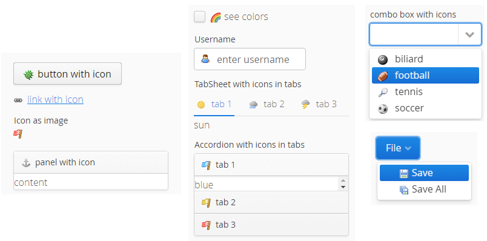

[](https://travis-ci.org/bienjaroslav/vaadin-fam3-silk-icons-addon)

# Famfamfam Silk Icons addon for Vaadin

Famfamfam Silk Icons addon for Vaadin provides you with the ability to use your Vaadin UI components with the image icons by
 [Mark James](http://www.famfamfam.com/lab/icons/silk/), e.g. like this:



## Using icon for Vaadin UI components
Just set the icon to any standard Vaadin UI component using its `setIcon()` method.

You can use the class [Fam3SilkIcon](https://github.com/bienjaroslav/vaadin-fam3-silk-icons-addon/vaadin-fam3-silk-icons/src/main/java/org/rubicone/vaadin/fam3/silk/Fam3SilkIcon.java)
 with enumerated all the icons from the set, example of usage:

```java
Button button = new Button();
button.setCaption("OK");
button.setIcon(Fam3SilkIcon.ACCEPT);
```

Alternatively you may use class [Fam3SilkIcons](https://github.com/bienjaroslav/vaadin-fam3-silk-icons-addon/vaadin-fam3-silk-icons/src/main/java/org/rubicone/vaadin/fam3/silk/Fam3SilkIcons.java)
 to get the icon by its filename (comparing to above, this approach does not
 load all the icons from the set into memory). Example of usage by specifying filename:

```java
ExternalResource icon = Fam3SilkIcons.get("accept.png");
Button button = new Button();
button.setCaption("OK");
button.setIcon(icon);
```

## Download release

Add following Maven dependency into your pom.xml:

```
<dependency>
    <groupId>org.rubicone.vaddons</groupId>
    <artifactId>fam3-silk-icons</artifactId>
    <version>1.0</version>
</dependency>
```

Official releases of this add-on are available at Vaadin Directory. For Maven instructions, download and reviews,
 go to https://vaadin.com/addon/fam3-silk-icons

## Building and running demo

```
git clone https://github.com/bienjaroslav/vaadin-fam3-silk-icons-addon.git
mvn clean install
cd demo
mvn jetty:run
```

To see the demo, navigate to http://localhost:8080/

Alternatively you may deploy the demo war into your application server.

## Famfamfam Silk Icons collection

The Famfamfam Silk Icons are created by [Mark James](http://www.famfamfam.com/lab/icons/silk/). 
The icons version currently included is 1.3.

**Note on icons license:**
The Famfamfam Silk Icons by [Mark James](http://www.famfamfam.com/lab/icons/silk/) are available under a
[Creative Commons Attribution 2.5 License](https://creativecommons.org/licenses/by/2.5/). You are free to use the icons.
Please do not forget to provide attribution in your work
(see [famfamfam website](http://www.famfamfam.com/lab/icons/silk/) for further details).

## Links
 - [Famfamfam Silk Icons by Mark James](http://www.famfamfam.com/lab/icons/silk/)
 - [All Famfamfam Silk Icons overview](http://www.famfamfam.com/lab/icons/silk/previews/index_abc.png)
 - [Famfamfam Silk Icons Search](http://www.dustball.com/icons/)
 - [Famfamfam Silk Icons Vaadin Addon's homepage](https://vaadin.com/addon/fam3-silk-icons)
